Дипломное задание по курсу «DevOps-инженер»  

Задание №1   
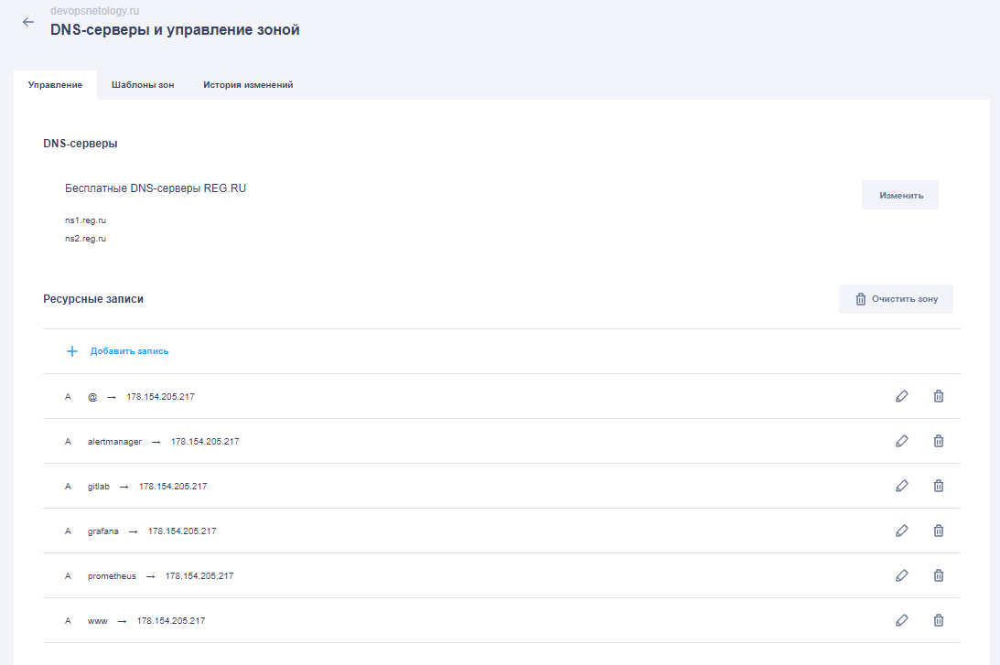  

Задание №2  
Переходим в директорию "terraform"  
Подставляем свои реквизиты в файле "providers.tf" в полях bucket, access_key, secret_key для настройки S3.  
Подставляем свои реквизиты в файле "variables.tf" в полях token, cloud_id, folder_id для подключения к яндекс облаку.  
Выполняем последовательно:
```commandline
terraform init
```
```commandline
terraform apply -auto-approve
```
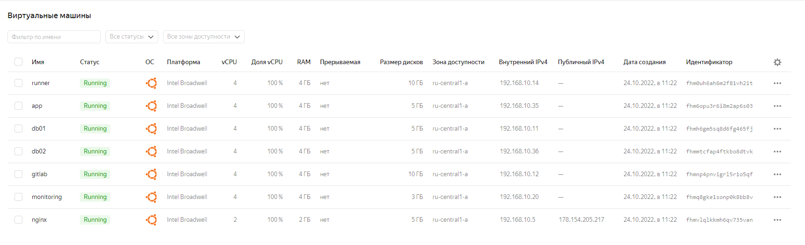  

Задание №3  
Переходим в директорию "ansible":
Выполняем:
```commandline
ansible-playbook -i inventory.ini nginx.yml
```
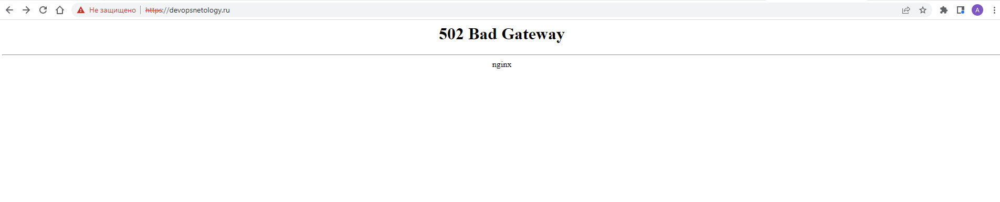
Если требуется получить нормальные сертификаты, то нужно убрать -test-cert в файле ansible\roles\install_nginx\tasks\main.yml  

Задание №4  
Выполняем:
```commandline
ansible-playbook -i inventory.ini mysql.yml
```
Проверяем master статус на db01:  
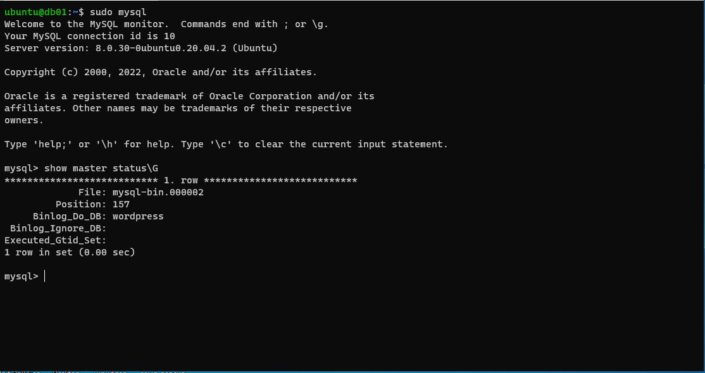
Проверяем slave статус на db02:  
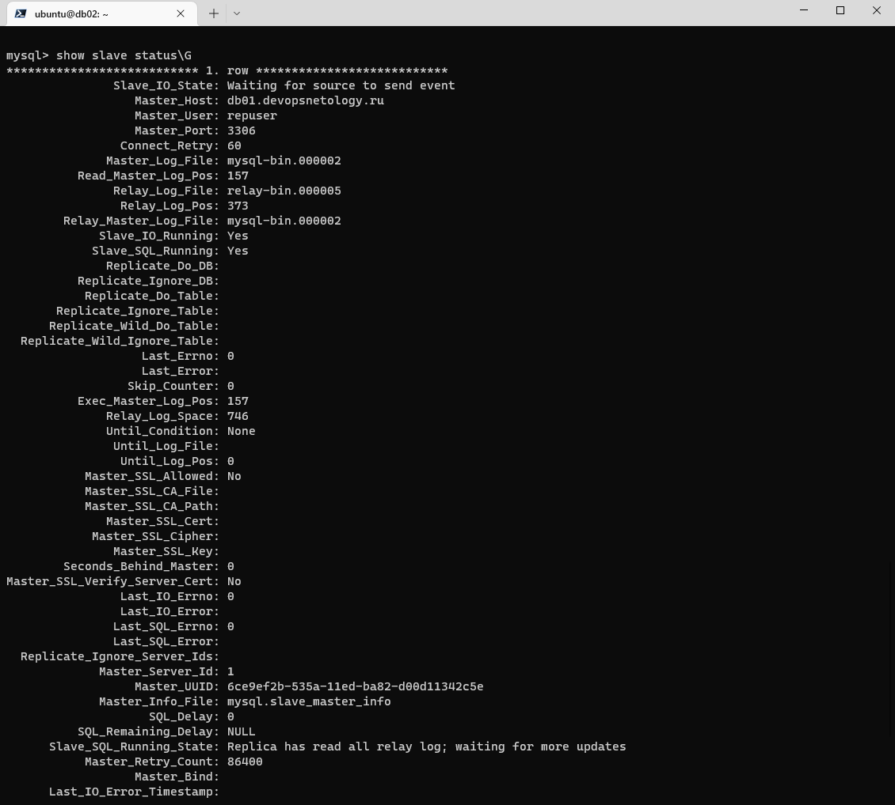

Задание №5   
Выполняем:
```commandline
ansible-playbook -i inventory.ini wordpress.yml
```
После успешного выполнения плейбука переходим по ссылке https:\\devopsnetology.ru  
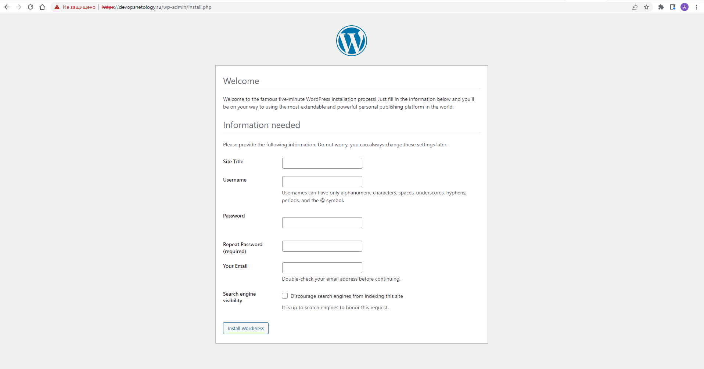
Заполняем начальные данные для сайта Wordpress указываем реквизиты подключения к БД и получаем доступ к WP
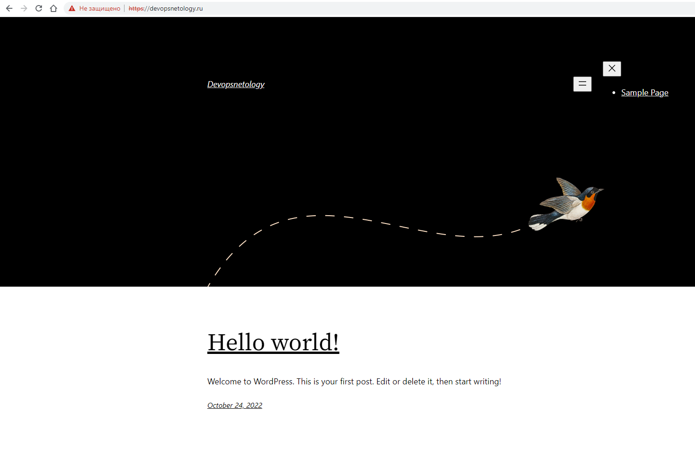

Задание №6  
Выполняем:
```commandline
ansible-playbook -i inventory.ini gitlab.yml
```
Заходим на сервер гитлаб:
```commandline
ssh -o "ProxyCommand ssh ubuntu@devopsnetology.ru nc %h %p" ubuntu@gitlab.devopsnetology.ru
```
Сбрасываем админский пароль гитлаб:  
```commandline
sudo gitlab-rake "gitlab:password:reset[root]"
```
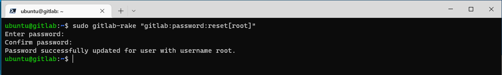
Логинимся в гитлаб, логин - root, пароль - сделан на предыдущем шаге.  
Узнаем текущий токен для подключения runner, прописываем полученный токен в inventory.ini  
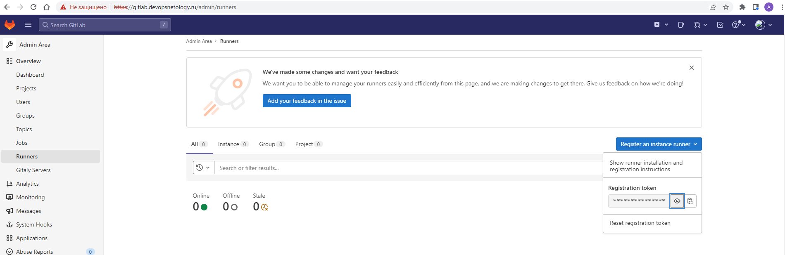
Запускаем плейбук:  
```commandline
ansible-playbook -i inventory.ini gitlab-runner.yml
```
После выполнения плейбука проверяем что раннер создан:
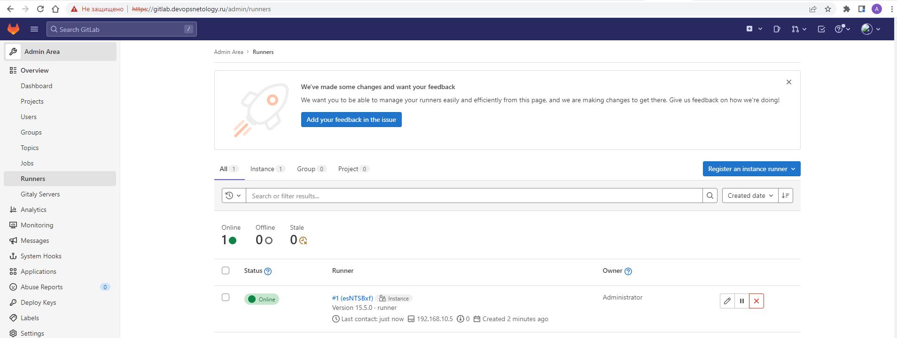

Добавляем закрытую часть ключа проброшенного на app.devopsnetology.com в переменные гитлаб.  
Добавляем проект, в нем добавляем pipeline со следующим кодом:  
```yaml
before_script:
  - eval $(ssh-agent -s)
  - echo "$ssh_ed25519" | tr -d '\r' | ssh-add -

stages:         
  - deploy

deploy-job:      
  stage: deploy
  script:
    - echo "Обнаружены изменения в репозитории..."
    - if [ "$CI_COMMIT_TAG" = "" ] ; then echo "Вносить изменения только с тэгами, отказ";
    - else echo "Обнаружен тэг, синхронизируем...";
      ssh -o StrictHostKeyChecking=no ubuntu@app.devopsnetology.ru sudo chmod -R 777 /var/www/wordpress/;
      rsync -vz -e "ssh -o StrictHostKeyChecking=no" ./* ubuntu@app.devopsnetology.ru:/var/www/wordpress/;
      fi
    - echo "Завершение"
```
Добавляем файл в проект, добавляем тег, делаем commit и видим что deploy-job выполнена успешно:  
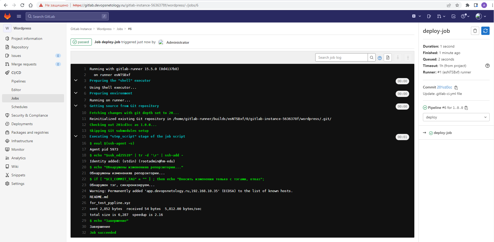

Задание №7  
Примечание: grafana недоступна из-за ограничений, скачана последняя версия файла по ссылке:
https://dl.grafana.com/enterprise/release/grafana-enterprise_9.2.1_amd64.deb  
Для выполнения плейбука нужно скачать целевой файл и поместить в директорию /ansible/roles/grafana/files  
Запускаем плейбук:  
```commandline
ansible-playbook -i inventory.ini monitoring.yml
```
Проверяем доступность prometheus:  
https://prometheus.devopsnetology.ru/targets?search=
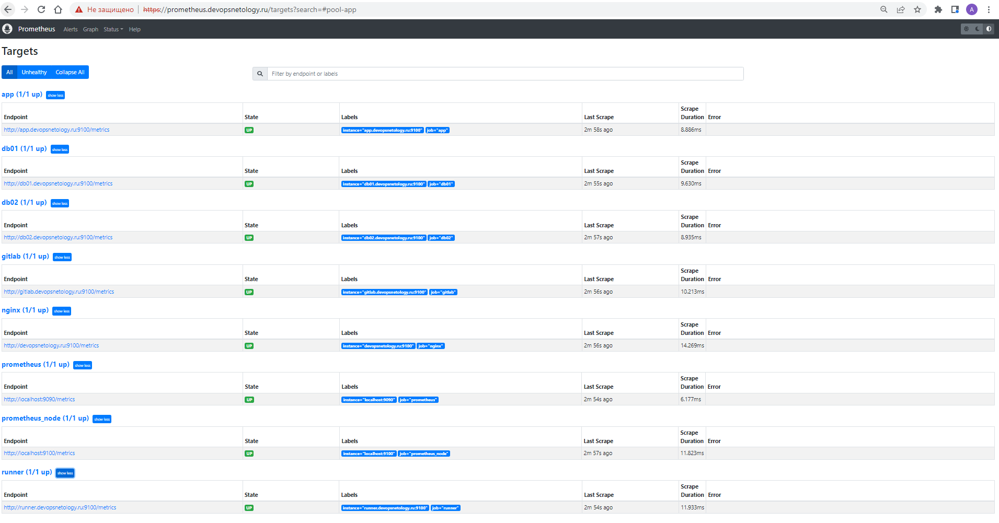
Подключаемся к grafana:  
https://grafana.devopsnetology.ru/   
Логинимся под реквизитами логин - admin, пароль - admin:  
Жмем на плитку "add datasource" и выбираем первый пункт "prometheus core"  
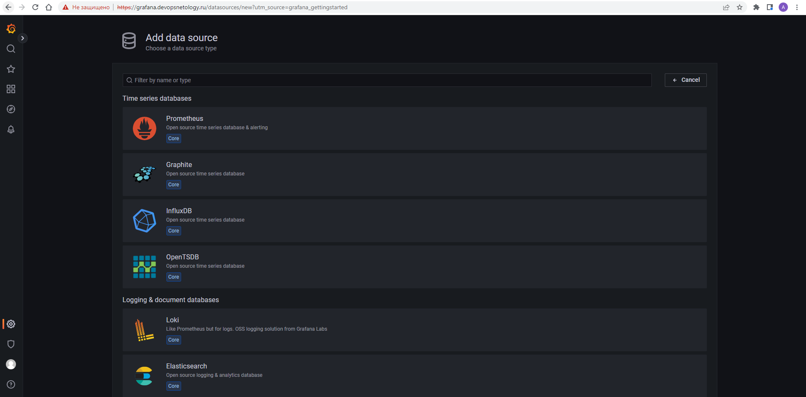
Во вкладке "Dashboards" импортируем Prometheus 2.0 Stats, на вкладке "Settings" указываем URL http://localhost:9090  
Жмем "Save & test" переходим в основное окно и открываем недавно добавленный дашбоард 
"Prometheus 2.0 Stats"  
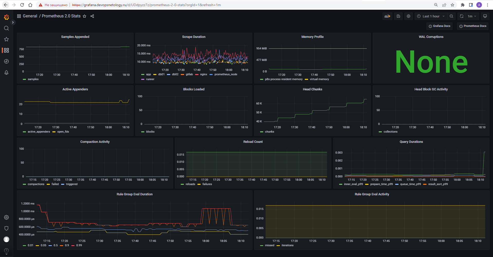

Большое спасибо за проверку диплома :)